# HARP-VLA: Runtime Instability Analysis and Selective Recovery

中文：面向 VLA 机器人策略的运行时不稳定性分析与选择性恢复

Research code and public evidence for studying whether Vision-Language-Action (VLA) robotic policies can recognize runtime instability and selectively route recovery before execution failure becomes irreversible.

The central question is not only whether a failed VLA rollout can be recovered. The main question is whether the robot can identify when execution is becoming unreliable, what kind of failure state it resembles, and whether it should continue, recover, demo-anchor, or request human review.

> Research prototype only. This repository is not a deployed robot safety system and does not claim hardware-validated autonomy.

## GitHub Reading Note

This public repository is organized around the final GitHub interpretation of the project. The strongest current claim is not "VLA recovery always works." The stronger and more defensible claim is:

> VLA execution instability can be observed through runtime evidence and routed into selective recovery decisions.

Current interpretation:

- HARP-VLA should be read as a runtime reliability layer, not only a recovery controller.
- Runtime instability analysis is the evidence layer; the route classifier is the final decision head.
- The committed metrics and figures validate the pipeline and visualization stack on a synthetic smoke run.
- Real robot or simulator claims require logged rollout data, seed/task metadata, leakage checks, and intervention validation.

## Application Entry

Start here:

1. [Full stage-ordered research report](docs/RESEARCH_REPORT.md)
2. [Integrated Word report](reports/HARP_VLA_Upgraded_Full_Experiment_Report_2026-06-25_VOA_visual_upgrade.docx)
3. [Route classifier metrics](outputs/recovery_route_classifier/metrics.json)
4. [Route predictions and explanations](outputs/recovery_route_classifier/route_explanations.csv)
5. [Recovery timing ablation](outputs/recovery_timing_ablation/summary.csv)
6. [Visual diagnostic figures](outputs/voa_visual_upgrade_figures/)

The intended application framing is trustworthy embodied AI and selective recovery for VLA robotic policies. It should not be described as a completed real-robot safety system.

## Research Summary

This repository contains a Python pipeline for execution-time reliability analysis, recovery route classification, timing ablation, and visual evidence generation for HARP-VLA.

Key ideas:

- embedding-space instability analysis, where execution windows are compared against success/recovery regions;
- action-outcome residual analysis, where intended actions are compared against observed outcomes;
- progress confirmation, so risk does not trigger unnecessary recovery while the task is still advancing;
- failure-state retrieval, where current execution is compared against success, failure, and recovery evidence;
- demo-anchored recovery, where demonstrations act as stabilizing priors rather than simple replay scripts;
- selective fallback and calibration, where the system chooses among `continue`, `recover_light`, `recover_strong`, `demo_anchor`, and `human_review`;
- recovery timing analysis, comparing immediate recovery, delayed recovery, and no recovery.

For the full stage-ordered account, including the rationale for each experiment, public evidence, limitations, and next experiments, see [docs/RESEARCH_REPORT.md](docs/RESEARCH_REPORT.md).

## Method And Evidence Chain

The project follows a staged reliability workflow. Each stage asks one research question and produces public aggregate evidence.

| Stage | Why this was done | Public evidence | Main finding |
| --- | --- | --- | --- |
| 1. Baseline recovery framing | Avoid overclaiming early tuned-controller success. | Integrated report and task0 evidence summary. | The project should not be presented as all failures solved; seed shift remains important. |
| 2. Runtime instability features | Failure should be measured before the terminal state. | `execution_features.csv`, decision-flow figure. | Embedding distance, residual, progress, confidence, and risk create an interpretable evidence layer. |
| 3. Embedding geometry | Check whether execution states occupy meaningful reliability regions. | PCA proxy figure. | Success, recovery, demo-anchor, and review states can be visualized in feature space. |
| 4. Progress and residual analysis | Prevent recovery from firing on risk alone. | Residual-progress diagnostic figure. | High residual plus stalled progress is stronger evidence for intervention. |
| 5. Failure-state retrieval | Different failures need different recovery evidence. | Risk-confidence figure, failure-neighbor ratio. | Retrieval confidence and local failure density support selective routing. |
| 6. Route classification | Convert instability evidence into recovery decisions. | Confusion matrix, feature importance, route explanations. | The decision head validates the pipeline but is not the whole contribution. |
| 7. Timing ablation | Recovery may become less useful if triggered too late. | Timing summary and heatmap. | Immediate recovery is strongest in the proxy analysis; delayed recovery loses recoverable cases. |
| 8. Visual evidence package | Make the process inspectable without reading all code. | README figures and integrated Word report. | The project can be reviewed as a sequence of evidence, decisions, and limitations. |

The central evidence chain is:

```text
VLA rollout
  -> embedding / residual / progress / retrieval signals
  -> runtime instability evidence
  -> recovery route decision
  -> continue / recover_light / recover_strong / demo_anchor / human_review
```

This is why the project is not presented as a simple VLA recovery script. The main research contribution is the analysis and routing of unreliable execution states.

## Runtime Instability Evidence at a Glance

HARP-VLA is built around one central idea:

> A VLA policy usually does not fail only at the final step. Failure often appears earlier as measurable runtime instability.

The project therefore analyzes execution before selecting a recovery route. The route classifier is only the final decision module; the main evidence comes from instability signals such as embedding drift, action-outcome residual, progress stagnation, retrieval uncertainty, and proximity to historical failure states.

```text
rollout execution
  -> embedding drift / residual / progress / retrieval signals
  -> runtime instability evidence
  -> recovery route classifier
  -> continue / recover_light / recover_strong / demo_anchor / human_review
```

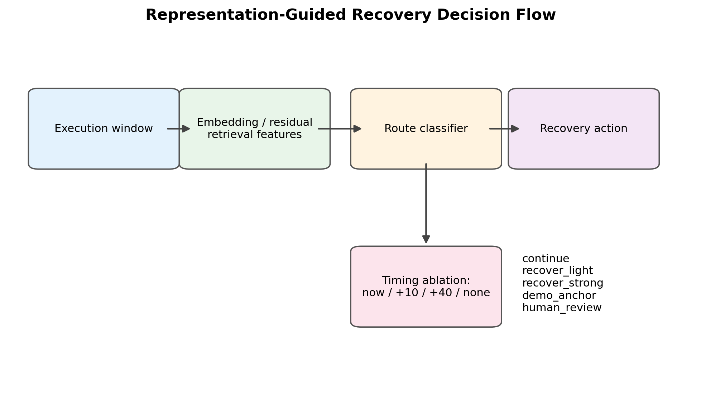

### What the Instability Analysis Measures

| Evidence signal | What it shows | Why it matters |
| --- | --- | --- |
| `embedding_distance` | Whether the current execution state is moving away from the success/recovery manifold | Detects drift before terminal failure |
| `action_outcome_residual` | Whether the commanded action produced the expected observed outcome | Captures slip, contact failure, or ineffective action |
| `progress_slope` | Whether task progress is still increasing or has stalled | Prevents unnecessary recovery when the task is still progressing |
| `retrieval_confidence` | Whether retrieved recovery evidence matches the current state | Controls when retrieval-based recovery is trustworthy |
| `failure_neighbor_ratio` | Whether the current state is close to historical failure states | Identifies failure-like regions in execution space |
| `start_risk` / `risk_score` | How risky the current recovery window is | Gates strong recovery, demo anchoring, or human review |

### Visual Evidence

The following figures show how runtime instability is made visible and then routed into selective recovery decisions.

| Execution representation | Risk and retrieval confidence |
| --- | --- |
| 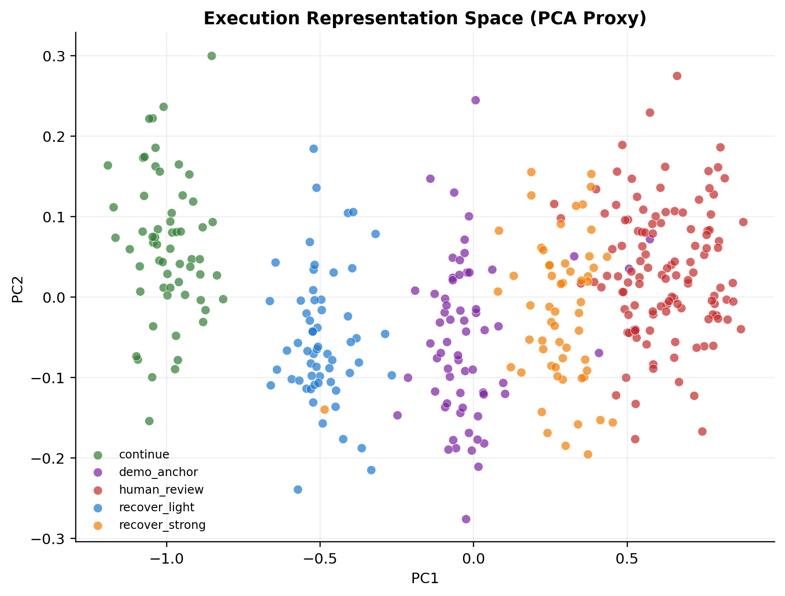 | 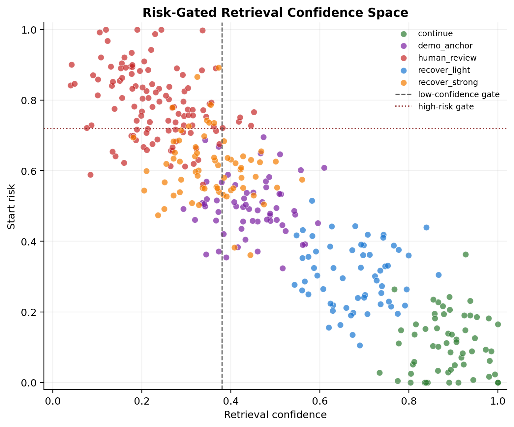 |

| Residual-progress diagnostic | Feature importance |
| --- | --- |
| 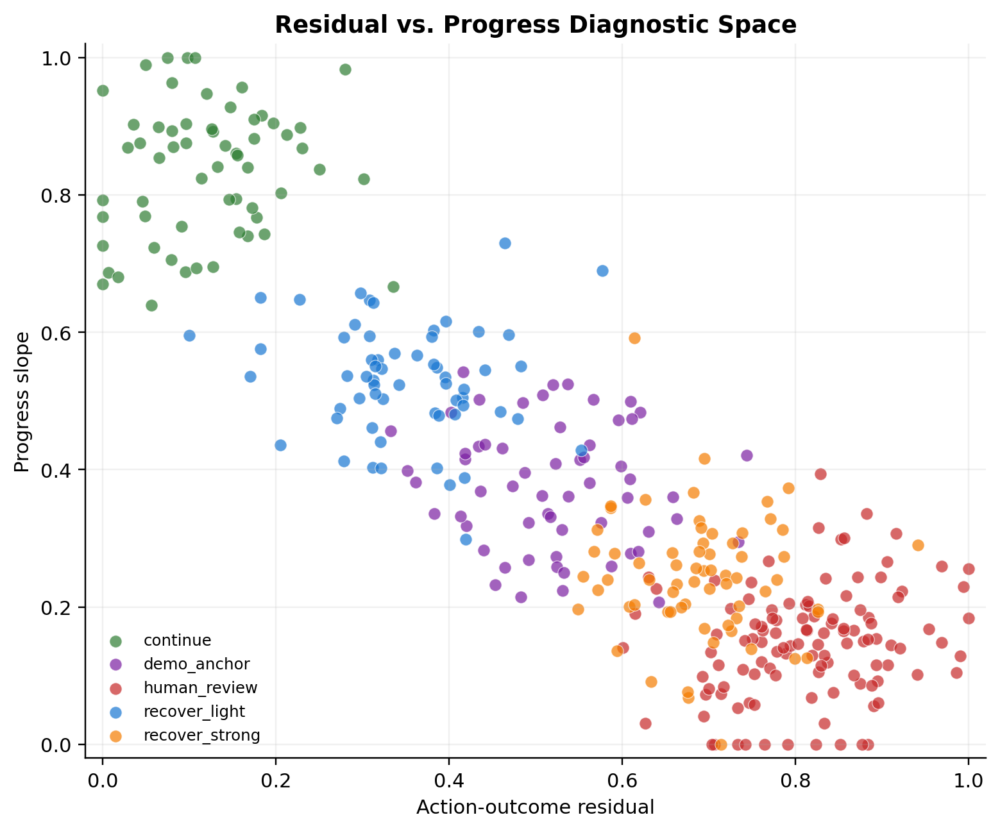 | 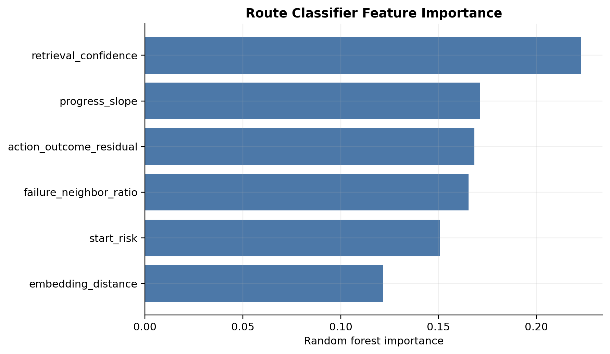 |

| Recovery route distribution | Recovery timing ablation |
| --- | --- |
| 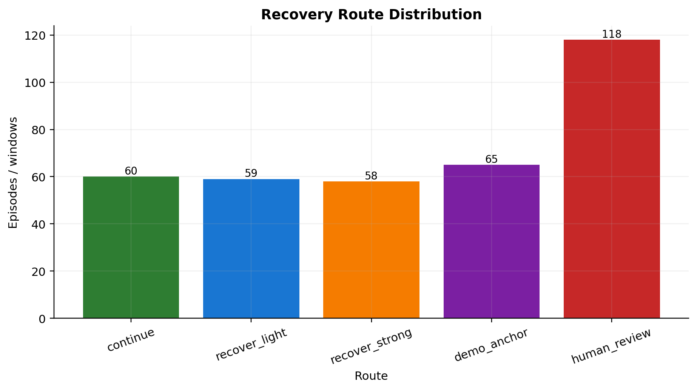 | 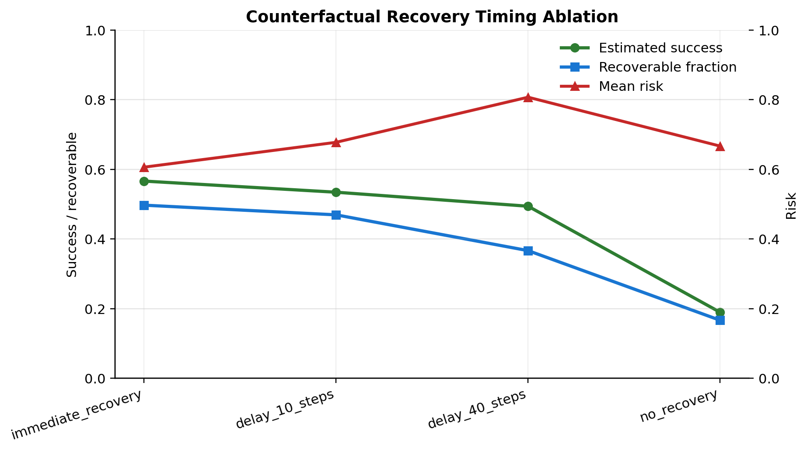 |

| Route confidence | Rollout trigger timeline |
| --- | --- |
| 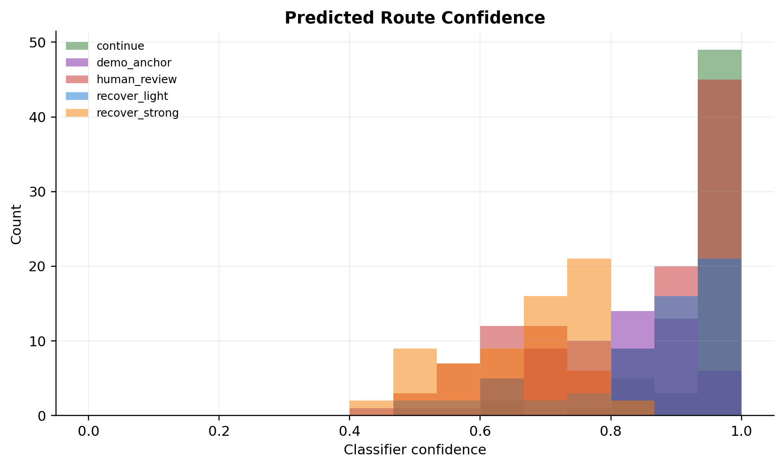 | 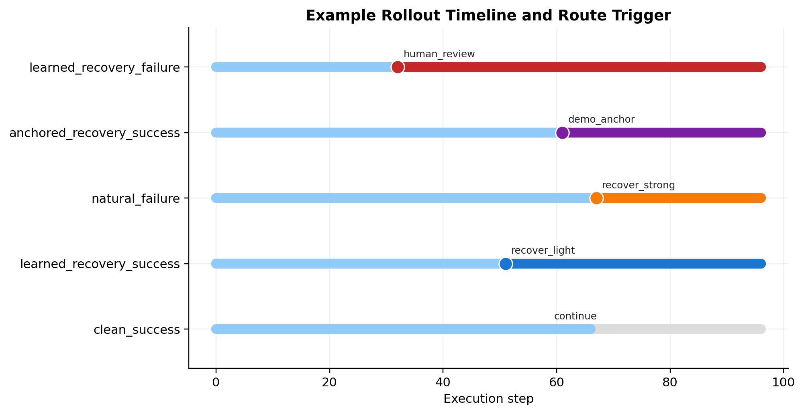 |

| Route-level timing heatmap | Schematic diagnostic panels |
| --- | --- |
| 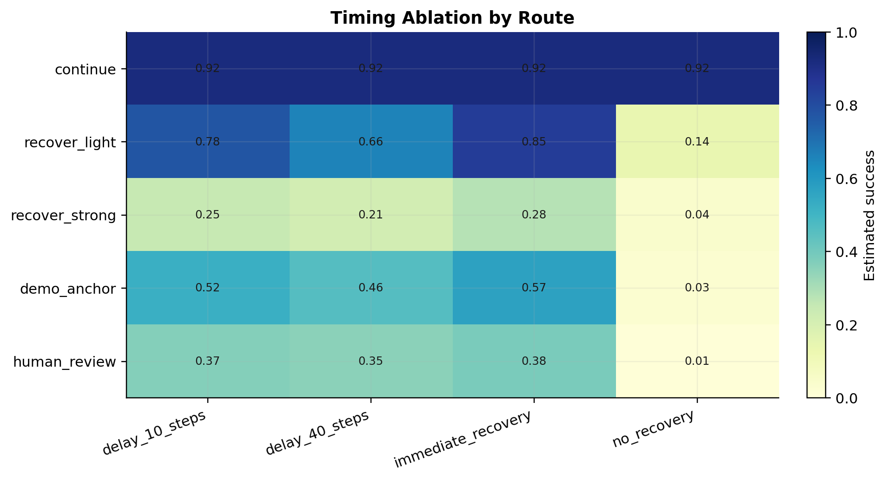 | 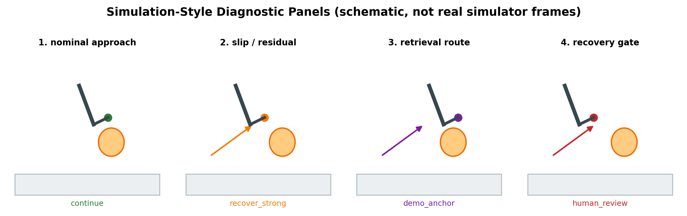 |

Interpretation:

- The PCA proxy visualizes how execution windows separate into success, recovery, demo-anchor, and human-review regions.
- The risk-confidence plot shows when retrieval evidence is trusted and when the system should escalate.
- The residual-progress plot shows why high residual plus stalled progress indicates stronger instability.
- Feature importance shows which reliability signals drive the route classifier.
- Timing ablation asks whether recovery must happen immediately or can be delayed.
- Route confidence and rollout timeline plots show whether the classifier is decisive and where recovery triggers occur during an episode.
- The schematic diagnostic panels are explanatory visuals only, not real simulator screenshots.

Evidence status: these committed figures validate the analysis and visualization pipeline. They should be replaced with real logged VOA/HARP rollout figures before making robot-performance claims.


## 1. Project Motivation

Vision-Language-Action (VLA) policies can execute complex robotic tasks from visual and language inputs, but their failures are often difficult to interpret. A rollout may look acceptable for many steps, then gradually drift, stall, miss contact, or enter a state where the original policy can no longer recover.

Early versions of this project focused on the question:

> If a VLA policy fails, can we recover it?

The current version asks a deeper research question:

> How does VLA execution become unstable, and how should a robot decide when, how strongly, and through which expert to recover?

This is why the project is now framed as:

> Runtime Instability Analysis and Selective Recovery for Vision-Language-Action Robotic Policies.

The goal is not to claim that every failure is solved. The goal is to build an execution-time reliability layer that can observe instability, confirm whether intervention is needed, retrieve relevant recovery evidence, and choose an appropriate recovery route.

## 2. Relation to RAM

This project is complementary to Retrieval-Augmented Manipulation (RAM).

RAM is mainly a planning-side method:

- retrieve object-centric spatial priors
- improve spatial awareness before execution
- help the robot plan better subgoals or actions

HARP-VLA is mainly an execution-side method:

- verify whether execution actually reaches the intended subgoal
- detect action-outcome mismatch during rollout
- retrieve failure-state recovery experts or demonstrations
- decide whether to continue, recover, demo-anchor, or request human review

Core framing:

> RAM makes the robot spatially aware before execution; HARP-VLA makes the robot failure-aware during execution.

中文：

> RAM 让机器人执行前更懂空间；HARP-VLA 让机器人执行中更懂失败。

## 3. Central Research Problem

The project studies four execution-time questions:

1. **How does failure appear?**  
   Does the rollout suddenly fail, or does it gradually move away from successful behavior?

2. **When should recovery trigger?**  
   Should the system intervene immediately when risk rises, or wait until task progress also stalls?

3. **Which recovery expert should be used?**  
   Are all failures handled by one fallback policy, or should different failure states retrieve different recovery experts?

4. **How strong should recovery be?**  
   Should the robot continue, lightly recover, strongly recover, use demonstration anchoring, or stop for human review?

These questions form the full HARP-VLA logic.

## 4. Role of Runtime Instability Analysis

Runtime instability analysis is not just a classifier. It is the evidence layer that makes recovery decisions meaningful.

The classifier only answers the final routing question:

> Given the current evidence, which recovery route should be selected?

The instability analysis answers the earlier and more important diagnostic questions:

- Is the rollout moving away from normal successful execution?
- Is the action producing the expected physical outcome?
- Is task progress slowing down or stalled?
- Is the current state close to historical success, historical failure, or an uncertain region?
- Is the system still confident enough to recover autonomously?

In HARP-VLA, instability is measured through runtime signals:

- `embedding_distance`: distance from the success/recovery manifold
- `action_outcome_residual`: mismatch between intended action and observed outcome
- `progress_slope`: whether the task is still making progress
- `retrieval_confidence`: confidence that retrieved evidence matches the current state
- `failure_neighbor_ratio`: local density of historical failure states
- `start_risk` / `risk_score`: estimated recovery risk

The analysis pipeline is:

```text
rollout execution
  -> embedding drift / residual / progress / retrieval signals
  -> runtime instability evidence
  -> recovery route classifier
  -> continue / recover_light / recover_strong / demo_anchor / human_review
```

Therefore, the research contribution is not simply "classifying failures." The key contribution is making VLA execution instability visible, measurable, and actionable before the final failure state.

## 5. Method Logic

HARP-VLA is built as a five-layer reliability pipeline. Each layer solves a weakness in the previous layer.

### Layer 1: Embedding Instability

**Problem.**  
If we only look at final success or failure, we learn too late. The robot may already be unrecoverable.

**Idea.**  
VLA failure can be observed before the terminal state. During execution, action-outcome embeddings can gradually drift away from a success manifold and move closer to historical failure regions.

**Signals.**

- policy embedding
- action embedding
- state embedding
- embedding distance
- action-outcome residual
- retrieval distance

**Role in the system.**  
This layer turns failure from a binary final label into a measurable runtime instability signal.

### Layer 2: Progress Confirmation

**Problem.**  
Risk alone is not enough. A high-risk signal may appear even when the task is still progressing. Triggering recovery too early can damage trajectories that would have succeeded.

**Idea.**  
The system should confirm that task progress has stalled before escalating recovery.

**Signals.**

- progress slope
- recent subgoal progress
- action-outcome residual
- risk score

**Role in the system.**  
This layer prevents unnecessary intervention. It connects instability detection to actual task progress.

### Layer 3: Failure-State Retrieval

**Problem.**  
Different failures need different recovery behavior. A grasp slip, a visual-state mismatch, and a near-target drift should not all use the same fallback.

**Idea.**  
Retrieve historical failure states, success states, or recovery examples that are close to the current execution state.

**Signals.**

- retrieval confidence
- failure-neighbor ratio
- distance to success states
- distance to failure states

**Role in the system.**  
This layer converts "something is wrong" into "this looks like a specific type of failure."

### Layer 4: Demo-Anchored Recovery

**Problem.**  
Learned recovery can itself become unstable, especially when retrieval confidence is low or the current state is outside the reliable region.

**Idea.**  
Use demonstrations as stable priors. Demo anchoring is not simple replay; it is a way to constrain recovery toward known reliable behavior.

**When it is useful.**

- retrieval confidence is low
- action-outcome residual is high
- learned recovery has failed before
- current state is near a high-risk region

**Role in the system.**  
This layer gives the system a middle option between autonomous recovery and full human review.

### Layer 5: Selective Fallback and Calibration

**Problem.**  
Recovery strength must be calibrated. Too weak recovery may not fix the failure. Too strong or too early recovery may interrupt a trajectory that was still recoverable.

**Idea.**  
The system should select among multiple recovery routes rather than using one fixed fallback.

**Routes.**

- `continue`: keep executing
- `recover_light`: apply mild correction
- `recover_strong`: use stronger recovery
- `demo_anchor`: use demonstration-guided recovery
- `human_review`: stop automatic recovery and request review

**Role in the system.**  
This layer turns instability analysis into an actionable execution-time decision.

## 6. How the Layers Connect

The project logic is sequential:

```text
Execution rollout
  -> embedding / residual signals
  -> progress confirmation
  -> failure-state retrieval
  -> route classifier
  -> recovery strength / demo anchor / human review
```

Each layer answers a different question:

| Layer | Question | Output |
| --- | --- | --- |
| Embedding instability | Is the rollout drifting? | Runtime instability signal |
| Progress confirmation | Is the task actually stalled? | Intervention evidence |
| Failure-state retrieval | What kind of failure is this? | Similar failure/recovery evidence |
| Demo anchoring | Is autonomous recovery trustworthy? | Demonstration-guided fallback |
| Selective calibration | How strong should recovery be? | Route decision |

This is the main upgrade: HARP-VLA is no longer a single recovery trigger. It is a structured reliability layer.

## 7. Current Evidence

The current report uses a conservative evidence framing:

- task0 has **25 valid seed/init evaluations**
- **21/25 success**
- **13 zero-backup successes**
- **4 effective recovery failures**
- early seed1000/seed1001 **10/10** is treated as initial tuned-controller evidence
- the 10/10 result is not used as the final full-project headline
- seed shift exposes that fixed thresholds are not yet robust

This is important because the project does not claim "all failures are solved."

The more defensible claim is:

> VLA execution instability can be observed, measured, and routed into selective recovery decisions.

## 8. 2026-06-25 Upgrade

The latest upgrade adds a representation-guided recovery layer.

It extracts or derives:

- policy embedding norm
- action embedding norm
- state embedding norm
- embedding distance
- action-outcome residual
- progress slope
- retrieval distance
- retrieval confidence
- failure-neighbor ratio
- start risk
- risk score

These features train a recovery route classifier.

Inputs:

- embedding distance
- failure-neighbor ratio
- progress slope
- action-outcome residual
- retrieval confidence
- start risk

Outputs:

- `continue`
- `recover_light`
- `recover_strong`
- `demo_anchor`
- `human_review`

## 9. Recovery Route Interpretation

| Route | Meaning |
| --- | --- |
| `continue` | The state is still close to the success manifold and progress is acceptable. |
| `recover_light` | The state shows mild drift or progress slowdown, but is still recoverable with light correction. |
| `recover_strong` | The state is close to historical failure regions or has high action-outcome residual. |
| `demo_anchor` | Retrieval confidence is low or learned recovery is unreliable, so demonstration evidence is used as a stabilizing prior. |
| `human_review` | The visual state, goal state, or risk state is too uncertain for trusted automatic recovery. |

## 10. Visual Diagnostics

The upgrade adds visual outputs so the project is easier to inspect and explain.

Figures are stored in:

```text
outputs/voa_visual_upgrade_figures/
```

Key figures:

- route distribution
- feature importance
- risk-confidence space
- residual-progress diagnostic space
- execution manifold PCA proxy
- predicted route confidence
- rollout trigger timeline
- timing ablation
- route-level timing heatmap
- decision flow diagram
- simulation-style diagnostic panels

Note: the simulation-style panels are schematic explanatory visuals, not real simulator screenshots.

## 11. Repository Structure

```text
configs/                         Experiment configuration
data_templates/                  Real rollout CSV template
docs/                            Method notes and data contract
outputs/recovery_route_classifier/   Metrics, predictions, explanations
outputs/recovery_timing_ablation/    Timing ablation summaries
outputs/voa_visual_upgrade_figures/  Visual diagnostics
reports/                         Markdown report and integrated DOCX
scripts/                         Run, validate, visualize, and assemble reports
src/voa_recovery/                Core pipeline
```

## 12. Run

Synthetic smoke validation:

```bash
python scripts/run_voa_recovery_upgrade.py --run-label voa_synthetic_smoke
python scripts/validate_voa_recovery_pipeline.py
python scripts/generate_voa_visuals.py
```

Real rollout table:

```bash
python scripts/run_voa_recovery_upgrade.py --input-rollouts path/to/voa_rollout_features.csv --run-label voa_real_rollouts
python scripts/generate_voa_visuals.py
```

## 13. Current Smoke Metrics

The committed smoke run validates the pipeline and visualization stack only.

- accuracy: **0.944**
- macro-F1: **0.943**
- missed manual/demo escalation rate: **0.073**
- false manual/demo escalation rate: **0.019**

These are not real robot performance claims. Real claims require logged rollout data, seed/task metadata, leakage checks, and simulator or hardware validation.

## 14. Project Positioning

HARP-VLA is a runtime reliability layer for VLA robotic policies.

It detects execution instability, confirms task progress, retrieves failure-state recovery evidence, routes recovery strength, and calibrates fallback, demo-anchor, and human-review decisions.

中文总结：

> HARP-VLA 不是简单的失败恢复模块，而是一个执行期可靠性系统：它分析 VLA 运行时不稳定性，判断是否需要恢复，选择恢复 expert 和恢复强度，并在不确定时转向 demo anchor 或 human review。
