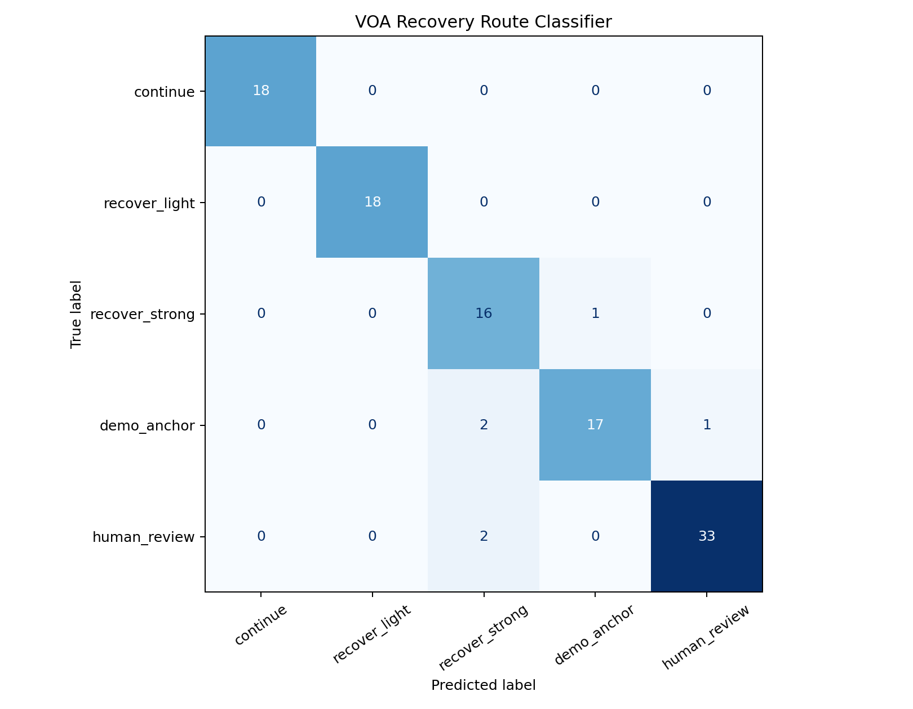

# Research Report

Runtime Instability Analysis and Selective Recovery for Vision-Language-Action Robotic Policies

中文题目：面向 VLA 机器人策略的运行时不稳定性分析与选择性恢复

This report summarizes the public, research-safe version of the HARP-VLA project. It is written for a reader who has not seen the local experiment archive and needs to understand the full experimental logic: why the project was designed, what was tested, what improved, what remains preliminary, and what should be validated next.

The project is a research prototype only. It is not a deployed robot safety system, not a hardware-validated recovery controller, and not evidence of real-world autonomy certification.

## 1. Research Question

Vision-Language-Action (VLA) policies can execute robot tasks from visual and language inputs, but their failures are often hard to interpret. A rollout may appear normal for many steps, then gradually drift, stall, miss contact, or enter a state where the original policy can no longer recover.

The central research question is not only whether a failed rollout can be recovered. The more important question is:

> Can VLA execution instability be observed during rollout, and can that evidence be used to decide when to continue, recover lightly, recover strongly, use demonstration anchoring, or request human review?

This framing changes the project from ordinary post-failure recovery into execution-time reliability analysis. The goal is to make VLA failure visible, measurable, and actionable before the terminal failure state.

## 2. Project Framing

HARP-VLA is complementary to Retrieval-Augmented Manipulation (RAM).

RAM is a planning-side idea: it retrieves object-centric spatial priors so that the robot is more spatially aware before execution.

HARP-VLA is an execution-side idea: it checks whether execution is actually progressing, detects action-outcome mismatch, retrieves failure-state recovery evidence, and routes the recovery decision.

Core sentence:

> RAM makes the robot spatially aware before execution; HARP-VLA makes the robot failure-aware during execution.

## 3. Experimental Roadmap

The experiments are organized into nine stages.

| Stage | Purpose | Main evidence |
| --- | --- | --- |
| 1. Baseline recovery framing | Establish the original recovery problem and avoid overclaiming early success. | Task0 seed/init evidence, zero-backup successes, effective recovery failures. |
| 2. Runtime instability features | Convert failure from a terminal label into measurable execution signals. | Embedding distance, residual, progress slope, retrieval confidence, risk score. |
| 3. Progress confirmation | Prevent unnecessary recovery when risk rises but the task is still progressing. | Progress slope and residual-progress diagnostic space. |
| 4. Failure-state retrieval | Distinguish success-like, failure-like, and uncertain execution states. | Retrieval confidence, failure-neighbor ratio, risk-confidence space. |
| 5. Demo-anchored recovery | Use demonstrations as stabilizing priors when learned recovery is uncertain. | Demo-anchor route, low-confidence and high-risk regions. |
| 6. Recovery route classifier | Turn instability evidence into recovery route decisions. | Confusion matrix, route predictions, feature importance. |
| 7. Recovery timing ablation | Test whether immediate recovery is more useful than delayed recovery. | Immediate, delay-10, delay-40, and no-recovery summaries. |
| 8. Visual evidence package | Make the process inspectable for a supervisor or reviewer. | README figures, report figures, visual snapshot section. |
| 9. Evidence discipline and limitations | Separate pipeline validation from real robot claims. | Synthetic-smoke status, real-rollout data contract, limitations. |

## 4. Stage 1: Baseline Recovery Framing

The project began as a VLA recovery prototype. The early question was simple:

> If the policy fails, can a recovery controller help?

The current report uses a more conservative evidence framing:

- task0 has 25 valid seed/init evaluations;
- 21/25 success;
- 13 zero-backup successes;
- 4 effective recovery failures;
- early seed1000/seed1001 10/10 success is retained as initial tuned-controller evidence, not the final full-project headline;
- seed shift exposes that fixed thresholds are not yet robust.

Main conclusion: the project should not be presented as "all failures are solved." The defensible claim is that VLA execution instability can be observed and routed into selective recovery decisions.

Public evidence:

- `reports/HARP_VLA_Upgraded_Full_Experiment_Report_2026-06-25_VOA_visual_upgrade.docx`
- `reports/representation_guided_recovery_report.md`

## 5. Stage 2: Runtime Instability Features

This stage defines the core diagnostic idea: failure is not only a final binary outcome. It can appear during execution as instability in representation and action-outcome space.

The pipeline extracts or derives:

- `policy_embedding_norm`
- `action_embedding_norm`
- `state_embedding_norm`
- `embedding_distance`
- `action_outcome_residual`
- `progress_slope`
- `retrieval_distance`
- `retrieval_confidence`
- `failure_neighbor_ratio`
- `start_risk`
- `risk_score`

These are not only classifier inputs. They are the evidence layer used to answer:

- Is the current execution drifting away from normal success?
- Is the commanded action producing the expected outcome?
- Is task progress slowing down?
- Is the current state close to historical success, historical failure, or uncertainty?
- Is the system confident enough to recover autonomously?

Public evidence:

Main conclusion: runtime instability analysis is the front end of the method. The route classifier is only the final decision outlet.

## 6. Stage 3: Embedding Geometry And Execution Manifold Proxy

The embedding analysis asks whether execution windows occupy different regions of a reliability feature space. PCA is used as a diagnostic visualization, not as proof of separability.

The key question is:

> Do success, recovery, demo-anchor, and human-review cases form interpretable regions in execution feature space?

Public summary:

Interpretation:

- success-like and recovery-like states occupy different parts of the proxy space;
- human-review and high-risk cases are visually separated from clean-success cases;
- the projection is explanatory evidence, not a standalone statistical guarantee;
- real embedding claims require real logged rollouts rather than synthetic smoke data.

Public evidence:

- `outputs/recovery_route_classifier/execution_features.csv`
- `outputs/voa_visual_upgrade_figures/fig07_execution_manifold_proxy.png`

## 7. Stage 4: Progress Confirmation And Residual Diagnostics

A recovery system should not intervene only because risk increases. A trajectory can look risky but still be progressing. The system therefore also checks whether task progress has stalled.

This stage studies two linked signals:

- `action_outcome_residual`: mismatch between intended action and observed outcome;
- `progress_slope`: whether recent task progress is increasing or stalled.

Public summary:

Interpretation:

- low residual and high progress support `continue`;
- mild residual or mild progress slowdown supports `recover_light`;
- high residual plus low progress supports `recover_strong`;
- high uncertainty or high risk can route the case to `demo_anchor` or `human_review`.

Main conclusion: progress confirmation is what prevents the system from becoming an overactive fallback trigger.

## 8. Stage 5: Failure-State Retrieval And Risk-Gated Confidence

Failure-state retrieval asks whether the current execution state resembles historical success, historical failure, or an uncertain region.

The key signals are:

- `retrieval_confidence`;
- `failure_neighbor_ratio`;
- `embedding_distance`;
- `start_risk`.

Public summary:

Interpretation:

- high confidence and low risk support autonomous continuation or light recovery;
- low confidence and high risk support demonstration anchoring or human review;
- failure-neighbor evidence makes the route decision more interpretable than a single scalar threshold.

Main conclusion: retrieval confidence is not just a planning prior. In HARP-VLA, it is execution-time evidence for whether the current state is recoverable by the autonomous system.

## 9. Stage 6: Demo-Anchored Recovery

Demo anchoring is introduced because learned recovery can be unreliable outside the familiar state region. Demonstrations are treated as stabilizing priors, not as simple replay scripts.

The system routes to `demo_anchor` when recovery evidence is uncertain but not necessarily unsafe enough for full human review.

The route interpretation is:

| Route | Meaning |
| --- | --- |
| `continue` | State remains close to success behavior and progress is acceptable. |
| `recover_light` | Mild drift or progress slowdown; light correction may be sufficient. |
| `recover_strong` | State is closer to historical failure or has high action-outcome residual. |
| `demo_anchor` | Retrieval confidence is low or learned recovery is unreliable; demonstration evidence should stabilize recovery. |
| `human_review` | Visual state, goal state, or risk cannot be trusted for automatic recovery. |

Public evidence:

- `outputs/recovery_route_classifier/route_explanations.csv`
- `outputs/recovery_route_classifier/route_predictions.csv`

Main conclusion: demo anchoring provides a middle option between fully autonomous recovery and human review.

## 10. Stage 7: Recovery Route Classifier

The route classifier turns instability evidence into an action decision. It is deliberately not described as the whole method. It is the decision head on top of the instability evidence layer.

Inputs:

- `embedding_distance`
- `failure_neighbor_ratio`
- `progress_slope`
- `action_outcome_residual`
- `retrieval_confidence`
- `start_risk`

Outputs:

- `continue`
- `recover_light`
- `recover_strong`
- `demo_anchor`
- `human_review`

Public summary:

Current synthetic-smoke metrics:

| Metric | Value | Interpretation |
| --- | ---: | --- |
| Episodes/windows | 360 | Synthetic smoke rows used for pipeline validation. |
| Train rows | 252 | Training split for the route classifier. |
| Test rows | 108 | Held-out split for smoke validation. |
| Accuracy | 0.944 | Overall route prediction accuracy on the smoke split. |
| Macro-F1 | 0.943 | Class-balanced route prediction score. |
| Missed manual/demo escalation rate | 0.073 | Manual/demo cases incorrectly routed as automatic. |
| False manual/demo escalation rate | 0.019 | Automatic cases conservatively escalated. |

Public evidence:

- `outputs/recovery_route_classifier/metrics.json`
- `outputs/recovery_route_classifier/confusion_matrix.png`
- `outputs/recovery_route_classifier/feature_importance.csv`

Main conclusion: the classifier validates the route-decision pipeline, but the synthetic smoke metrics should not be interpreted as real robot performance.

## 11. Stage 8: Recovery Timing Ablation

The timing ablation asks whether recovery should trigger immediately or whether delayed recovery is still useful.

Policies tested:

- immediate recovery;
- delay 10 steps;
- delay 40 steps;
- no recovery.

Public summary:

Current proxy timing summary:

| Policy | Estimated success | Mean risk | Recoverable fraction |
| --- | ---: | ---: | ---: |
| immediate recovery | 0.566 | 0.606 | 0.497 |
| delay 10 steps | 0.534 | 0.678 | 0.469 |
| delay 40 steps | 0.494 | 0.807 | 0.367 |
| no recovery | 0.190 | 0.667 | 0.167 |

Interpretation:

- immediate recovery has the strongest proxy success rate;
- delayed recovery gradually loses recoverable cases;
- no recovery is much weaker in the proxy model;
- this is a counterfactual analysis from execution features, not a real intervention rollout.

Public evidence:

- `outputs/recovery_timing_ablation/summary.csv`
- `outputs/recovery_timing_ablation/summary_by_route.csv`

Main conclusion: the project now asks a timing-sensitive recovery question rather than only a binary recovery question.

## 12. Stage 9: Visual Evidence And Report Integration

The project includes visual evidence so that the research process is inspectable without reading all code.

Key figures:

| Route distribution | Route confidence |
| --- | --- |
|  |  |

| Rollout trigger timeline | Schematic diagnostics |
| --- | --- |
|  |  |

The schematic diagnostic panels are explanatory visuals only. They are not real simulator screenshots.

Public evidence:

- `outputs/voa_visual_upgrade_figures/`
- `reports/HARP_VLA_Upgraded_Full_Experiment_Report_2026-06-25_VOA_visual_upgrade.docx`

Main conclusion: the project now presents the instability-to-recovery pipeline as an inspectable sequence of figures, tables, route explanations, and timing summaries.

## 13. Negative Results And Limitations

Important limitations:

- The committed metrics are synthetic smoke validation, not real robot or simulator success evidence.
- The route classifier labels are currently generated or supplied at rollout-table level; real deployment requires carefully logged execution windows.
- The timing ablation is counterfactual and proxy-based; it needs real intervention rollouts.
- PCA visualizations are diagnostic and explanatory, not proof of separability.
- The demo-anchor and human-review routes need real failure-state examples to evaluate safety and usefulness.
- The current repository does not include raw robot videos, real hardware logs, or full simulator rollouts.

These limitations are part of the research discipline. They prevent the project from overclaiming and define the next experiments.

## 14. What Is Shown, Suggested, And Unproven

Shown by the current public repository:

- the HARP-VLA reliability pipeline runs end to end;
- execution features can be exported into a route-classifier table;
- route metrics, explanations, feature importance, and timing summaries are generated;
- visual evidence can be rendered directly in the README and report;
- the method is structured as runtime instability evidence followed by selective recovery routing.

Suggested by the current evidence:

- embedding distance, residual, progress slope, retrieval confidence, and failure-neighbor ratio are useful signals for failure-aware routing;
- recovery timing is likely important, because delayed recovery loses recoverable cases in the proxy analysis;
- demo anchoring is a meaningful route for low-confidence but not necessarily fully unsafe states.

Not yet proven:

- real robot success-rate improvement;
- cross-task generalization;
- calibrated human-review safety thresholds;
- real visual closed-loop replacement;
- hardware-facing recovery reliability.

## 15. Recommended Next Experiments

The next experiments should replace synthetic smoke evidence with logged VOA/HARP rollouts.

Recommended sequence:

1. Export real rollout-level or window-level execution features.
2. Recompute embedding distance, residual, progress slope, retrieval confidence, failure-neighbor ratio, and risk score.
3. Label real outcomes as clean success, natural failure, learned recovery success/failure, demo-anchored recovery success, or human review.
4. Train and evaluate the route classifier on real task and seed splits.
5. Run real timing interventions: immediate recovery, delay 10, delay 40, and no recovery.
6. Report calibration, coverage-risk curves, missed escalation, false escalation, and route-level failure cases.
7. Keep hardware-facing recovery disabled until simulation or logged replay validates the route decisions.

## 16. Paper-Ready Summary

HARP-VLA studies runtime instability and selective recovery for Vision-Language-Action robotic policies. Instead of treating failure as only a terminal outcome, the project analyzes execution-time evidence: embedding drift, action-outcome residual, progress stagnation, retrieval confidence, local failure-neighbor density, and risk. These signals support a route classifier that selects whether to continue, recover lightly, recover strongly, use demonstration anchoring, or request human review. Current public results validate the pipeline and visualization stack on a synthetic smoke dataset, while the main empirical claims remain intentionally conservative until real logged rollout evidence is added.

## 17. Repository Pointers

Core files:

- `src/voa_recovery/pipeline.py`
- `scripts/run_voa_recovery_upgrade.py`
- `scripts/validate_voa_recovery_pipeline.py`
- `scripts/generate_voa_visuals.py`
- `configs/voa_recovery_upgrade.yaml`
- `data_templates/voa_rollout_features_template.csv`

Primary outputs:

- `outputs/recovery_route_classifier/metrics.json`
- `outputs/recovery_route_classifier/confusion_matrix.png`
- `outputs/recovery_route_classifier/feature_importance.csv`
- `outputs/recovery_route_classifier/route_predictions.csv`
- `outputs/recovery_route_classifier/route_explanations.csv`
- `outputs/recovery_timing_ablation/summary.csv`
- `outputs/voa_visual_upgrade_figures/`

Integrated reports:

- `README.md`
- `docs/RESEARCH_REPORT.md`
- `reports/representation_guided_recovery_report.md`
- `reports/HARP_VLA_Upgraded_Full_Experiment_Report_2026-06-25_VOA_visual_upgrade.docx`
